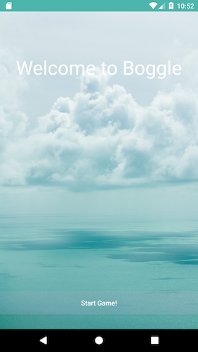
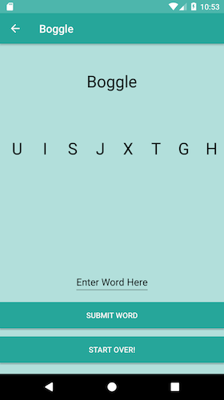

# Boggle

#### Epicodus Android Week 1 Pair Project, October 12, 2017

#### By Stephanie Mayer & Haneen Abu-Khater

## Table Of Contents

* [Description](#description)
* [View Of Application](#view-of-application)
* [Set-Up Requirements](#setup-requirements)
* [Specifications](#specifications)
* [Questions or Concerns](#questions-or-concerns)
* [Known Bugs](#known-bugs)
* [Technologies Used](#technologies-used)

## Description

_This application allows a user to play the game Boggle with 8 different letter choices, including two vowels in each set of letters._

## View Of Application

### This is what the main page of the application looks like

### The results look like when you search by a condition

## Setup Requirements
*

## Specifications

| Behavior      | Example Input      | Example Output       |
| ------------- | ------------- | ------------- |
|

## Questions or Concerns ##
__

## Known Bugs
_No known bugs at this time._

## Technologies Used

*

### License

Copyright &copy; 2017 Stephanie Mayer & Haneen Abu-Khater
